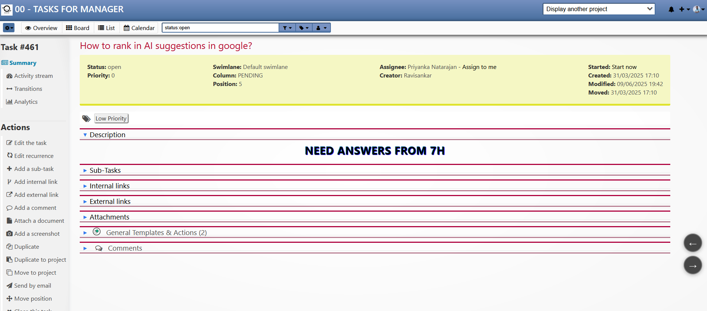

# Card Navigator Plugin for Kanboard

Navigate between tasks in the detail view with floating arrows and keyboard shortcuts.

## Features

- **Floating Navigation Buttons**: Left/right arrows in bottom-right corner (task detail view only)
- **Keyboard Shortcuts**: Ctrl+Left/Right to navigate between tasks  
- **Smart Ordering**: Navigate by column position → swimlane → task position
- **Zero Configuration**: Works immediately after installation
- **Lightweight**: Minimal footprint with efficient code
- **Permission-Aware**: Respects user project access rights

## Installation

### Automatic Installation
1. Go to **Settings → Plugins** in your Kanboard
2. Search for "Card Navigator" 
3. Click **Install**

### Manual Installation
1. Download the plugin from [GitHub](https://github.com/oliyan/CardNavigator)
2. Extract to `plugins/CardNavigator/` directory
3. Ensure proper file permissions (755 for folders, 644 for files)
4. Refresh Kanboard or clear cache

## Usage

### Navigation
**In Task Detail View:**
- Click floating arrow buttons (bottom-right corner)
- Use `Ctrl + Left Arrow` for previous task
- Use `Ctrl + Right Arrow` for next task

### Navigation Order
Tasks are ordered by:
1. **Column position** (left to right)
2. **Swimlane position** (top to bottom within column) 
3. **Task position** (within swimlane-column cell)

### Behavior
- Navigation limited to same project/board only
- Skips empty columns automatically  
- No wrapping around (stops at first/last task)
- Buttons become inactive at boundaries
- Works only in task detail view (not edit mode)

## Technical Details

- **Compatible with**: Kanboard ≥ 1.2.20
- **Tested on**: Kanboard 1.2.40
- **Dependencies**: None (pure JavaScript/CSS)
- **Database**: No database changes required
- **Performance**: Lightweight with minimal resource usage

## Repository Information

- **GitHub**: [https://github.com/oliyan/CardNavigator](https://github.com/oliyan/CardNavigator)
- **Author**: Ravisankar Pandian
- **License**: MIT License
- **Version**: 1.0.0

## Support

- **Issues**: Report bugs on [GitHub Issues](https://github.com/oliyan/CardNavigator/issues)
- **Documentation**: [Kanboard Plugin Documentation](https://docs.kanboard.org/v1/plugins/)

## Screenshots

Navigation appears as floating buttons in the bottom-right corner of task detail pages, providing seamless movement between tasks without returning to the board view.

## License

MIT License - Free for commercial and personal use.

## Contributing

Contributions welcome! Please submit pull requests to the GitHub repository.